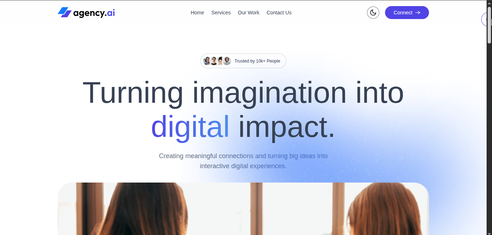

<div align="center">

# 🚀 Agency4AI

### *Turning imagination into digital impact*

[](https://salmanbintariq.github.io/agency4ai/)
[](https://react.dev/)
[](https://vitejs.dev/)
[](https://tailwindcss.com/)

**A modern AI-powered agency platform showcasing innovative digital solutions**

[Live Demo](https://salmanbintariq.github.io/agency4ai/) · [Report Bug](https://github.com/salmanbintariq/agency4ai/issues) · [Request Feature](https://github.com/salmanbintariq/agency4ai/issues)

</div>

---

## 📸 Screenshots

### 🏠 Hero Section


### 💼 Portfolio Showcase


---

## ✨ Features

- **⚡ React 19** - Latest React version with improved performance and features
- **🎨 Tailwind CSS 4** - Utility-first CSS framework for rapid UI development
- **🎭 Motion Animations** - Smooth, professional animations powered by Motion library
- **📧 Contact Form** - Integrated with Web3Forms for seamless submissions
- **🔔 Toast Notifications** - Beautiful notifications with React Hot Toast
- **🌓 Dark Mode** - Theme toggle for better user experience
- **📱 Fully Responsive** - Mobile-first design that works on all devices
- **⚙️ Hot Module Replacement** - Instant feedback during development
- **🚀 Optimized Build** - Production-ready builds with Vite

---

## 🛠️ Tech Stack

<div align="center">


</div>

### Core Technologies

- **React 19** - Latest React with improved hooks and concurrent features
- **Vite 7** - Next-generation frontend tooling
- **Tailwind CSS 4** - Utility-first CSS framework with JIT compilation
- **Motion** - Modern animation library (successor to Framer Motion)
- **React Hot Toast** - Elegant toast notifications
- **Web3Forms** - Backend-free form handling

---

## 🚀 Getting Started

### Prerequisites

- Node.js (v14 or higher)
- npm or yarn

### Installation

1. **Clone the repository**
   ```bash
   git clone https://github.com/salmanbintariq/agency4ai.git
   cd agency4ai
   ```

2. **Install dependencies**
   ```bash
   npm install
   # or
   yarn install
   ```

3. **Set up environment variables** (Optional)
   
   Create a `.env` file in the root directory:
   ```env
   VITE_WEB3FORMS_ACCESS_KEY=your_access_key_here
   ```
   
   Get your free access key from [Web3Forms](https://web3forms.com/)

4. **Start the development server**
   ```bash
   npm run dev
   ```
   
   Open [http://localhost:5173](http://localhost:5173) in your browser

---

## 📜 Available Scripts

| Command | Description |
|---------|-------------|
| `npm run dev` | Start development server with HMR |
| `npm run build` | Build for production |
| `npm run preview` | Preview production build locally |
| `npm run lint` | Run ESLint for code quality |
| `npm run deploy` | Deploy to GitHub Pages |

---

## 📁 Project Structure

```
agency4ai/
├── public/                 # Static assets
│   └── screenshots/        # Project screenshots
├── src/
│   ├── components/         # React components
│   ├── assets/            # Images, icons, styles
│   ├── App.jsx            # Main application component
│   └── main.jsx           # Application entry point
├── index.html             # HTML template
├── package.json           # Dependencies and scripts
├── vite.config.js         # Vite configuration
├── tailwind.config.js     # Tailwind CSS configuration
└── eslint.config.js       # ESLint configuration
```

---

## 🚢 Deployment

This project is deployed on **GitHub Pages** using the `gh-pages` package.

### Quick Deploy

```bash
npm run deploy
```

This command will automatically build and deploy your project to GitHub Pages.

### Manual Deployment

1. Ensure `homepage` is set correctly in `package.json`:
   ```json
   "homepage": "https://salmanbintariq.github.io/agency4ai/"
   ```

2. Build the project:
   ```bash
   npm run build
   ```

3. Deploy:
   ```bash
   npm run deploy
   ```

### GitHub Actions (Optional)

For automated deployment, create `.github/workflows/deploy.yml`:

```yaml
name: Deploy to GitHub Pages

on:
  push:
    branches: [ main ]

jobs:
  build-and-deploy:
    runs-on: ubuntu-latest
    steps:
      - uses: actions/checkout@v3
      
      - name: Setup Node.js
        uses: actions/setup-node@v3
        with:
          node-version: '18'
      
      - name: Install dependencies
        run: npm ci
      
      - name: Build
        run: npm run build
      
      - name: Deploy to GitHub Pages
        uses: peaceiris/actions-gh-pages@v3
        with:
          github_token: ${{ secrets.GITHUB_TOKEN }}
          publish_dir: ./dist
```

---

## 🔧 Configuration

### Tailwind CSS

This project uses **Tailwind CSS 4** with the Vite plugin. Customize your design system using CSS variables and `@theme` directives in your CSS files.

### Motion Animations

Motion provides smooth, performant animations. Example usage:

```jsx
import { motion } from "motion/react"

<motion.div
  initial={{ opacity: 0, y: 20 }}
  animate={{ opacity: 1, y: 0 }}
  transition={{ duration: 0.5 }}
>
  Your content here
</motion.div>
```

### Web3Forms Integration

The contact form uses Web3Forms for backend-free submissions. Configure your access key in the environment variables or directly in the component.

---

## 🤝 Contributing

Contributions are what make the open-source community such an amazing place to learn, inspire, and create. Any contributions you make are **greatly appreciated**.

1. Fork the Project
2. Create your Feature Branch (`git checkout -b feature/AmazingFeature`)
3. Commit your Changes (`git commit -m 'Add some AmazingFeature'`)
4. Push to the Branch (`git push origin feature/AmazingFeature`)
5. Open a Pull Request

---

## 📝 License

Distributed under the MIT License. See `LICENSE` for more information.

---

## 👨‍💻 Author

**Muhammad Salman**

- 📧 Email: [salmantariq8018@gmail.com](mailto:salmantariq8018@gmail.com)
- 💼 LinkedIn: [muhammad-salman-182171230](https://www.linkedin.com/in/muhammad-salman-182171230)
- 🐙 GitHub: [@salmanbintariq](https://github.com/salmanbintariq)

---

## 🙏 Acknowledgments

- [React](https://react.dev/) - A JavaScript library for building user interfaces
- [Vite](https://vitejs.dev/) - Next Generation Frontend Tooling
- [Tailwind CSS](https://tailwindcss.com/) - A utility-first CSS framework
- [Motion](https://motion.dev/) - A modern animation library for React
- [React Hot Toast](https://react-hot-toast.com/) - Smoking hot React notifications
- [Web3Forms](https://web3forms.com/) - Contact form backend without a backend
- [GitHub Pages](https://pages.github.com/) - Hosting platform

---

## 📞 Support

For support, email [salmantariq8018@gmail.com](mailto:salmantariq8018@gmail.com) or open an issue in the [GitHub repository](https://github.com/salmanbintariq/agency4ai/issues).

---

<div align="center">

### ⭐ Star this repository if you find it helpful!

Made with ❤️ by [Muhammad Salman](https://github.com/salmanbintariq)

</div>